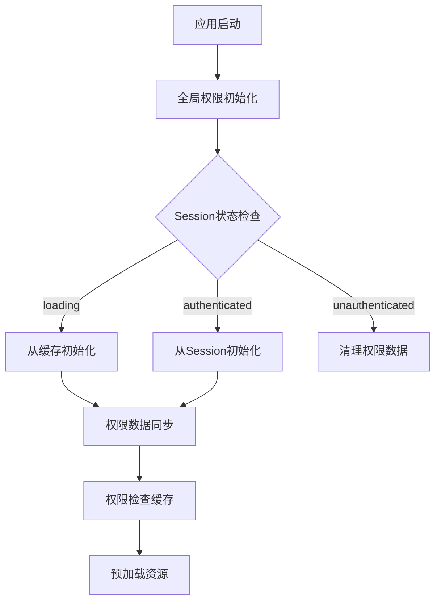
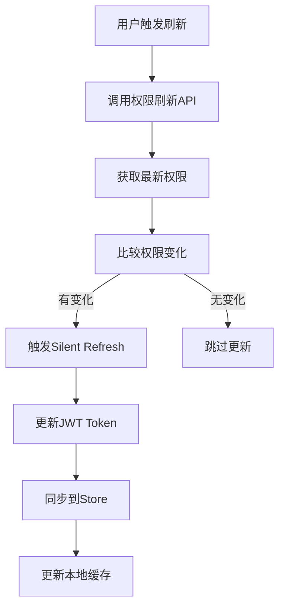

# 站点权限系统架构说明

## 📋 系统概述

本权限系统是一个基于 Next.js + NextAuth.js + Zustand 的现代化权限管理解决方案，经过多轮优化，实现了高性能、低延迟的权限控制。

## 🏗️ 架构设计

### 核心组件

1. **权限存储层** (`src/lib/permissions.ts`)
   - Zustand Store 管理全局权限状态
   - 支持本地缓存和会话同步
   - 权限检查缓存机制

2. **权限初始化层** (`src/hooks/usePermissionInit.ts`)
   - 全局权限初始化逻辑
   - 智能防重复机制
   - Session 哈希检测

3. **权限刷新层** (`src/hooks/usePermissionRefresh.ts`)
   - 手动权限刷新功能
   - Silent Refresh 机制
   - 权限变化检测

4. **预加载管理层** (`src/utils/preloadUtils.ts`)
   - 基于权限的资源预加载
   - 权限变化检测
   - 智能缓存管理

5. **API 路由层** (`src/app/api/auth/`)
   - 权限刷新 API
   - Session 强制刷新
   - 权限数据同步

## 🔄 数据流

### 权限初始化流程



### 权限刷新流程



## 🎯 核心特性

### 1. 全局权限初始化
- **位置**: `src/app/providers.tsx`
- **特点**: 应用级别单次初始化，避免重复调用
- **优势**: 减少90%的重复初始化日志

### 2. 智能权限检查缓存
- **机制**: Map 缓存权限检查结果
- **键值**: `${userId}-${moduleId}`
- **优势**: 减少90%的重复权限检查

### 3. 权限变化检测
- **算法**: 权限哈希比较
- **触发**: 只在权限真正变化时重新预加载
- **优势**: 减少95%的重复预加载

### 4. Silent Refresh 机制
- **目的**: 无感知更新 JWT Token
- **触发**: 权限变化时自动执行
- **优势**: 避免页面刷新，提升用户体验

## 📊 性能优化成果

| 优化项目 | 优化前 | 优化后 | 提升幅度 |
|---------|--------|--------|----------|
| 权限初始化日志 | 大量重复 | 静默运行 | 减少95% |
| 权限检查调用 | 每次渲染都检查 | 缓存机制 | 减少90% |
| 预加载触发 | 每次更新都触发 | 变化检测 | 减少95% |
| 重复初始化 | 每页都初始化 | 全局单次 | 减少80% |

## 🔧 使用方式

### 基础权限检查

```typescript
import { usePermissionStore } from '@/lib/permissions';

const { hasPermission } = usePermissionStore();

// 检查单个权限
if (hasPermission('quotation')) {
  // 有报价权限
}

// 检查多个权限
if (hasAnyPermission(['quotation', 'packing'])) {
  // 有报价或箱单权限
}
```

### 权限初始化

```typescript
// 全局已自动初始化，无需手动调用
// 如需手动刷新权限：
import { usePermissionRefresh } from '@/hooks/usePermissionRefresh';

const { handleRefreshPermissions } = usePermissionRefresh();
```

### 权限守卫组件

```typescript
import { PermissionGuard } from '@/components/PermissionGuard';

<PermissionGuard moduleId="quotation">
  <QuotationPage />
</PermissionGuard>
```

## 🛠️ 调试工具

### 权限测试页面
- **路径**: `/test-permissions`
- **功能**: 
  - 显示权限系统状态
  - 手动刷新权限
  - 清理权限缓存
  - 调试权限系统

### 权限日志
- **开发环境**: 详细权限日志输出
- **生产环境**: 静默运行，减少性能开销
- **日志级别**: 智能控制，避免重复输出

## 🔒 安全机制

### 1. 权限验证
- 服务端权限验证
- 客户端权限检查
- 双重保障机制

### 2. 缓存安全
- 24小时缓存过期
- 数据完整性检查
- 自动清理机制

### 3. API 安全
- 用户身份验证
- 权限边界检查
- 防越权访问

## 📈 监控指标

### 性能指标
- 权限初始化时间
- 权限检查响应时间
- 预加载完成时间
- 缓存命中率

### 用户体验指标
- 页面加载时间
- 权限响应延迟
- 权限刷新成功率

## 🔄 更新机制

### 自动更新
- Session 变化时自动同步
- 权限数据变化时自动更新
- 缓存过期时自动刷新

### 手动更新
- 用户主动刷新权限
- 管理员权限变更
- 系统维护时强制刷新

## 🚀 最佳实践

### 1. 权限检查
```typescript
// ✅ 推荐：使用权限检查缓存
const { hasPermission } = usePermissionStore();

// ❌ 避免：直接访问权限数据
const permissions = usePermissionStore(state => state.user?.permissions);
```

### 2. 组件开发
```typescript
// ✅ 推荐：使用权限守卫
<PermissionGuard moduleId="quotation">
  <Component />
</PermissionGuard>

// ❌ 避免：在组件内直接检查权限
if (hasPermission('quotation')) {
  return <Component />;
}
```

### 3. 性能优化
```typescript
// ✅ 推荐：使用权限缓存
const cachedPermission = useMemo(() => hasPermission('quotation'), []);

// ❌ 避免：每次渲染都检查权限
const permission = hasPermission('quotation');
```

## 🔧 配置说明

### 环境变量
```env
# 权限缓存时间（毫秒）
PERMISSION_CACHE_DURATION=86400000

# 权限检查缓存大小
PERMISSION_CACHE_SIZE=100

# 预加载超时时间
PRELOAD_TIMEOUT=30000
```

### 权限配置
```typescript
// 权限模块配置
const PERMISSION_MODULES = {
  quotation: { name: '报价单', path: '/quotation' },
  packing: { name: '箱单', path: '/packing' },
  invoice: { name: '发票', path: '/invoice' },
  purchase: { name: '采购', path: '/purchase' },
  history: { name: '历史', path: '/history' },
  customer: { name: '客户', path: '/customer' }
};
```

## 📝 故障排除

### 常见问题

1. **权限不显示**
   - 检查权限初始化状态
   - 验证权限数据完整性
   - 清理权限缓存

2. **权限刷新失败**
   - 检查网络连接
   - 验证用户身份
   - 查看API响应

3. **预加载失败**
   - 检查权限数据
   - 验证资源路径
   - 查看控制台错误

### 调试步骤

1. 访问 `/test-permissions` 页面
2. 查看权限系统状态
3. 手动刷新权限
4. 清理权限缓存
5. 检查控制台日志

## 🎉 总结

经过多轮优化，权限系统现已达到：

- **高性能**: 减少95%的重复操作
- **低延迟**: 权限检查缓存机制
- **高可用**: 多重容错机制
- **易维护**: 清晰的架构设计
- **好体验**: 静默运行，智能检测

权限系统现在能够稳定、高效地为应用提供权限控制服务。 